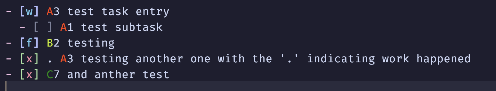

# taskra.nvim

A task list assistant.

Color highlights for my task priorities (A,B,C,D) automatically.

Strict, task expectations
- only in a markdown (.md) file
- a task line starts with `- [ ] ` optionally with a status (e.g. `- [x]` is completed)
- the prirotiy, following the `- [ ] `,  is single letter priority [ABCD] followed by a number (which I use to size the task, a fibonacci "story size" number)
It does allow for a dot `.`, separated by a space, before the priority. I use the dot to signify activity on the task has taken place today, and my notesutilmanager uses t dot indicator as a flag and removes the dot, then journals or archives the entry.

example:


Sorry, this doc has no install instructions, but below are config examples (currently the defaults)

A .config/nvim/lua/plugins/user.lua entry for taskra

```lua
  {
    "robertarles/taskra.nvim",
    ft = "markdown",
    lazy = true,

    -- dir = "user.plugins.taskra", -- This points to the file we created
    config = function()
      local taskra = require "taskra"
      vim.api.nvim_set_hl(0, "TaskraRed", { fg = "#FF4060" })
      vim.api.nvim_set_hl(0, "TaskraRed", { fg = "#FF4000" })
      vim.api.nvim_set_hl(0, "TaskraYellow", { fg = "#C7F000" })
      vim.api.nvim_set_hl(0, "TaskraGreen", { fg = "#008B00" })
      vim.api.nvim_set_hl(0, "TaskraBlue", { fg = "#00008B" })

      taskra.add_syntax_rule("- %[.%] [ .]*([aA])%d ", "TaskraRed")
      taskra.add_syntax_rule("- %[.%] [ .]*([bB])%d ", "TaskraYellow")
      taskra.add_syntax_rule("- %[.%] [ .]*([cCdDeEfF])%d ", "TaskraGreen")
      taskra.add_syntax_rule("- %[([^xX])%] ", "Warning")
      taskra.add_syntax_rule("- %[([xX])%] ", "Error")

      -- Add text manipulation functions
      taskra.add_text_function("upper", function()
        local line = vim.api.nvim_get_current_line()
        vim.api.nvim_set_current_line(line:upper())
      end)

      -- create a vim command
      vim.api.nvim_create_user_command("ReloadTaskra", function()
        package.loaded["taskra"] = nil
        require("taskra").setup()
        vim.cmd "bufdo e"
      end, {})

      -- Setup the plugin
      taskra.setup()
    end,
  },
```
